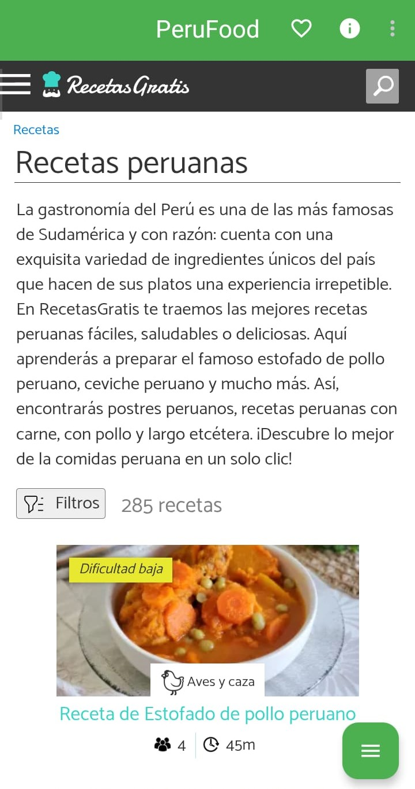
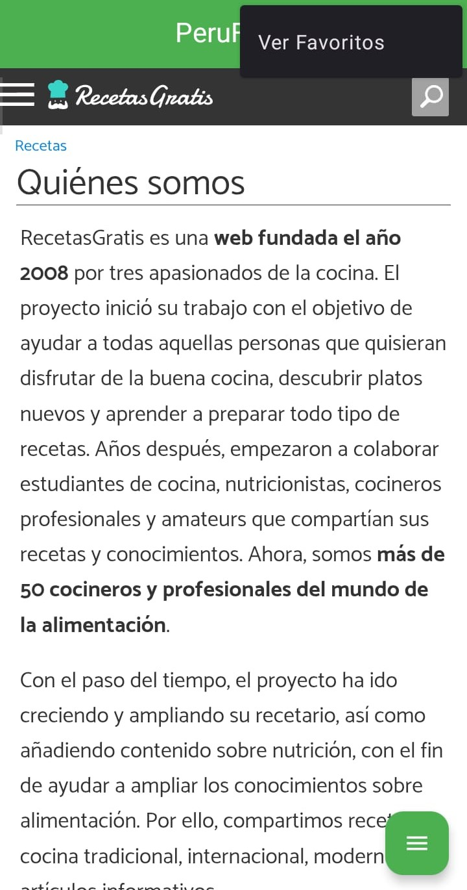
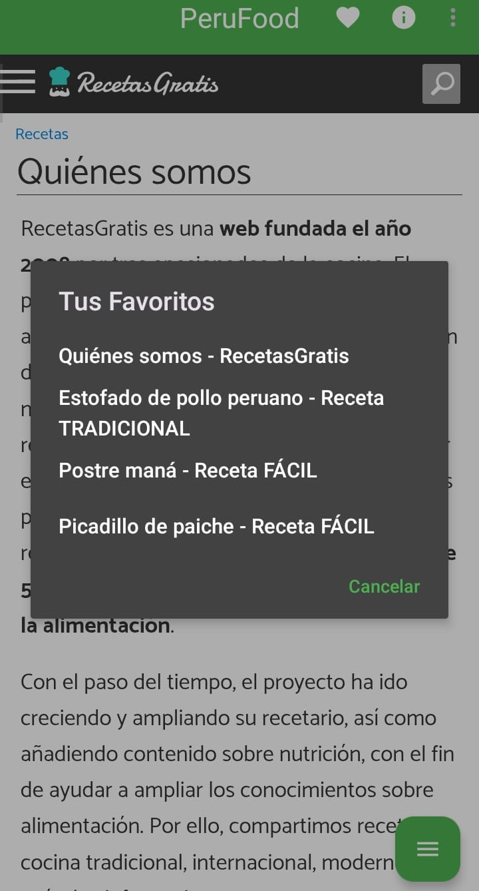
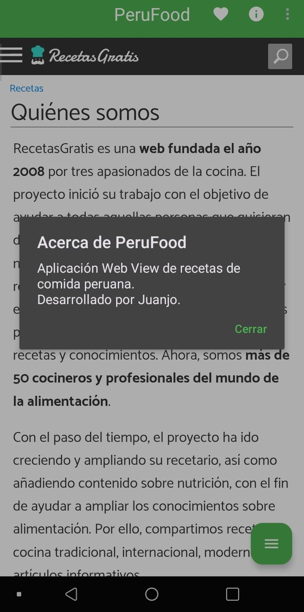
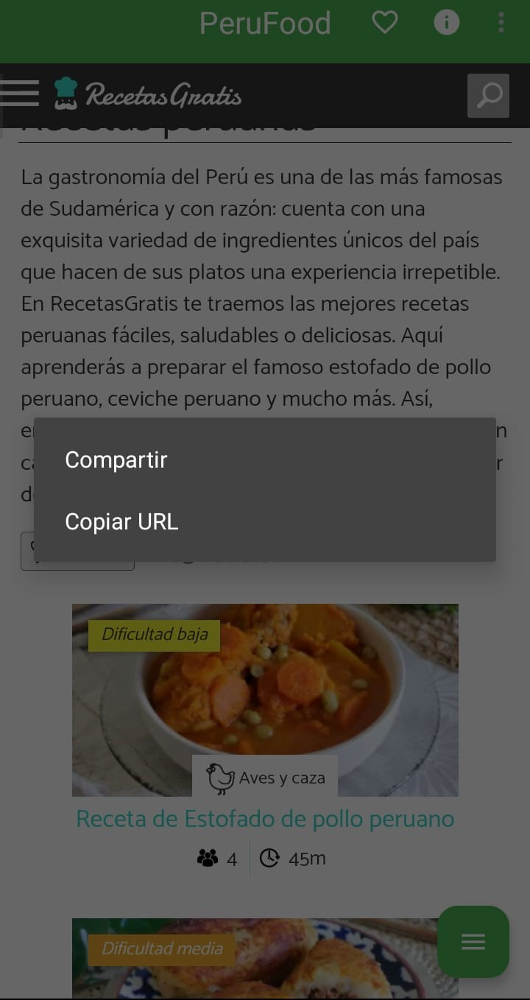
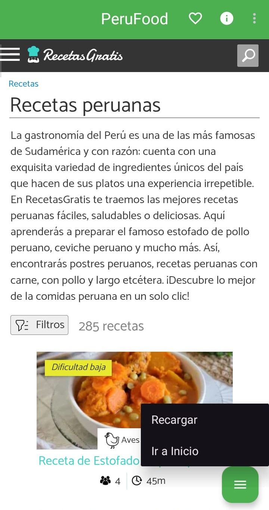

# AppWebView 

**AppWebView** es una aplicación Android desarrollada como tarea académica para el laboratorio de la semana 8. Permite al usuario explorar recetas de comida peruana mediante una interfaz simple y moderna basada en Material Design 3, utilizando un componente WebView.

## 📱 Características principales

- 🌐 Navegación web embebida con WebView.
- ❤️ Gestión de favoritos persistente (guardado y eliminación con SharedPreferences).
- 📋 Menú contextual:
  - Compartir receta
  - Copiar URL
- ⚙️ Menú flotante con opciones rápidas:
  - Recargar página
  - Ir a página principal
- 🧭 Menú de opciones superior:
  - Ver información de la app
  - Agregar/eliminar favoritos
  - Ver lista de favoritos

## 🛠️ Tecnologías utilizadas

- Kotlin
- Android SDK
- WebView
- SharedPreferences
- Material Components (Material Design 3)
- XML Layouts

## 📸 Capturas de pantalla

- Pantalla Principal de la aplicación

- El Menú Main está compuesto por: "Me gusta" (Icono de corazón), "Acerca de (Icono de la letra i circular)" y el menú de "Ver Favoritos"

  - El icono de "Me gusta" estará sin sombrear cuando el usuario no lo haya marcado, caso contrario se sombreará y se guardará a la lista de favoritos.
  

  

  - En Ver Favorito se verán las secciones donde se marcó como Favoritas (corazón sombreado)
  
  

    - En "Acerca de " se mostrará un modal con información sobre la aplicación y se abrirá la sección de "¿Quienes somos?" de la página web
  

- El Menú Contextual donde podremos compartir la sección de la receta y copiar su URL.

- El PopUp Menu nos permite recargar la página y redireccionarnos al Inicio.

